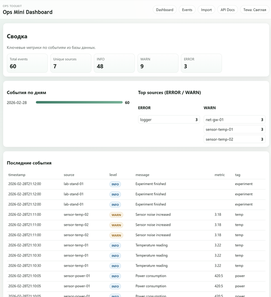
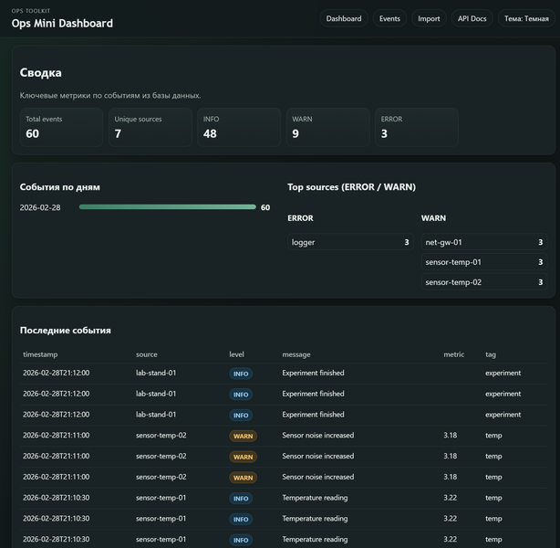
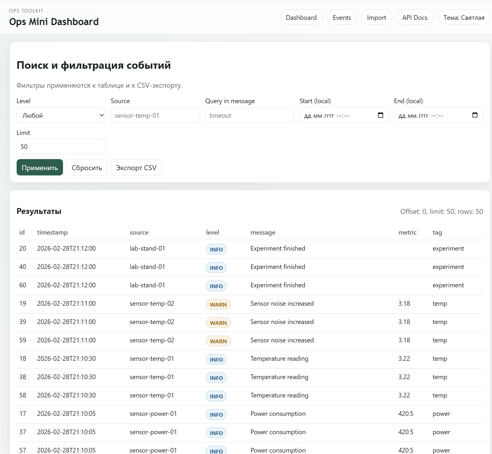
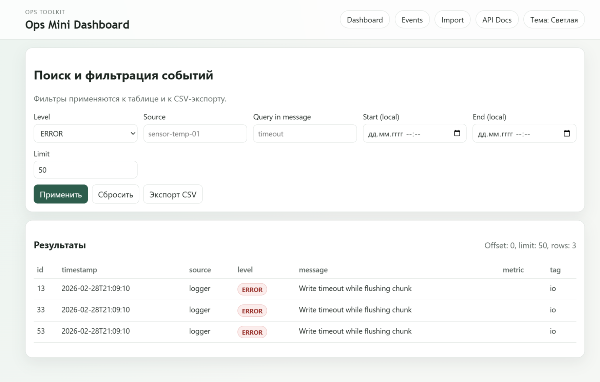
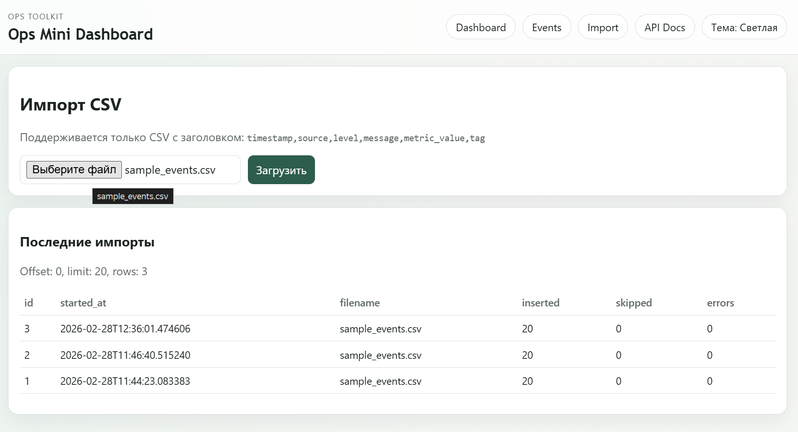
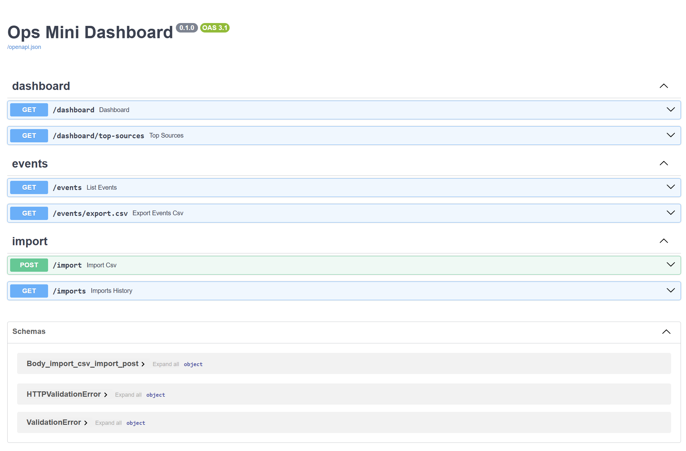

# Ops Mini Dashboard


Внутренний веб-инструмент для инженеров и техслужбы: загружаешь CSV с событиями — получаешь сводку, фильтрацию и экспорт.

---

## Что решает

Когда оборудование, сервисы или тестовые стенды пишут логи в CSV, сложно быстро ответить на вопросы:
- Сколько ошибок было за день и откуда они?
- Какой источник шумит больше всех?
- Что происходило в конкретный промежуток времени?

Ops Mini Dashboard решает это без Excel и ручной фильтрации: загрузил файл — сразу видишь картину.

---

## Для кого

- **Инженер / лаборант** — смотрит события эксперимента, отклонения, ошибки записи.
- **Техслужба / эксплуатация** — мониторит типовые проблемы, ищет первопричины сбоев.
- **IT / DevOps** — просматривает сетевые и сервисные события в виде простого журнала.

---

## Возможности

### MVP (v0.1)
- Импорт CSV через веб-форму — с проверкой формата и статистикой (`inserted / skipped / errors`)
- Список событий с фильтрами: по уровню, источнику, тексту сообщения, диапазону дат
- Dashboard: счётчики, график событий по дням, последние 20 событий
- Экспорт отфильтрованной выборки в CSV (до 5000 строк)

### Дополнения v0.2
- История импортов с пагинацией (`GET /imports`)
- Топ источников по уровням ERROR и WARN (`GET /dashboard/top-sources`)
- Web UI на Jinja2 + HTMX: таблица событий обновляется без перезагрузки страницы
- Удобный выбор диапазона времени (`datetime-local` контролы)
- Переключение светлой / тёмной темы с сохранением в браузере

---

## Скриншоты

### Dashboard — светлая и тёмная тема

<table>
  <tr>
    <td></td>
    <td></td>
  </tr>
  <tr>
    <td align="center">Светлая тема</td>
    <td align="center">Тёмная тема</td>
  </tr>
</table>

### Фильтрация событий

<table>
  <tr>
    <td></td>
    <td></td>
  </tr>
  <tr>
    <td align="center">Все уровни</td>
    <td align="center">Только ERROR</td>
  </tr>
</table>

### Импорт CSV и API-документация

<table>
  <tr>
    <td></td>
    <td></td>
  </tr>
  <tr>
    <td align="center">Импорт CSV</td>
    <td align="center">Swagger / OpenAPI</td>
  </tr>
</table>

---

## Быстрый старт

### 1. Создать виртуальное окружение

```bash
python -m venv .venv
```

Windows:
```bash
.venv\Scripts\activate
```

macOS / Linux:
```bash
source .venv/bin/activate
```

### 2. Установить зависимости

```bash
pip install -r requirements.txt
```

### 3. Запустить сервер

```bash
uvicorn app.main:app --reload
```

После запуска доступны:

| Адрес | Что открывается |
|---|---|
| `http://127.0.0.1:8000/ui/dashboard` | Dashboard |
| `http://127.0.0.1:8000/ui/events` | Список событий с фильтрами |
| `http://127.0.0.1:8000/ui/import` | Загрузка CSV / JSON |
| `http://127.0.0.1:8000/docs` | Swagger / OpenAPI |

---

## Загрузка демо-данных

В репозитории есть готовые файлы с событиями:
- `data/sample_events.csv` — 20 событий в формате CSV
- `data/sample_events.json` — 5 событий в формате JSON

**Через веб-интерфейс:**
1. Открыть `http://127.0.0.1:8000/ui/import`
2. Нажать «Выберите файл», выбрать `data/sample_events.csv` или `data/sample_events.json`
3. Нажать «Загрузить»

**Через API (curl):**
```bash
# CSV
curl -X POST http://127.0.0.1:8000/import \
     -F "file=@data/sample_events.csv"

# JSON
curl -X POST http://127.0.0.1:8000/import \
     -F "file=@data/sample_events.json"
```

Форматы описаны в [`docs/data-format.md`](docs/data-format.md).

---

## Стек

| Слой | Технология |
|---|---|
| Backend | Python 3.11+, FastAPI |
| База данных | SQLite + SQLAlchemy 2.0 |
| Шаблоны | Jinja2 + HTMX |
| Тесты | pytest + httpx |
| Линтер | ruff |

---

## Документация

| Документ | Описание |
|---|---|
| [`docs/tz.md`](docs/tz.md) | Техническое задание |
| [`docs/architecture.md`](docs/architecture.md) | Архитектура и модель данных |
| [`docs/API.md`](docs/API.md) | Описание всех эндпоинтов |
| [`docs/data-format.md`](docs/data-format.md) | Формат CSV |
| [`docs/decision-log.md`](docs/decision-log.md) | Почему приняты те или иные решения |
| [`docs/testplan.md`](docs/testplan.md) | Чеклист ручного тестирования |
| [`docs/project-defense.md`](docs/project-defense.md) | Защита проекта |
| [`docs/roadmap.md`](docs/roadmap.md) | Планы развития |

---

## Что планируется дальше

### v0.3
- Переход на PostgreSQL для поддержки больших объёмов
- Ускорение импорта через bulk insert
- Быстрые пресеты фильтров и фильтрация по тегу

### v1.0
- Приём событий через API (без CSV)
- Алерты по правилам (порог / регулярное выражение)
- Пользователи и роли
- Аудит действий

---

## Не входит в MVP

- Авторизация и роли
- Real-time стриминг (WebSocket)
- Алерты и уведомления
- Сложный фронтенд (SPA)
- Мультитенантность
